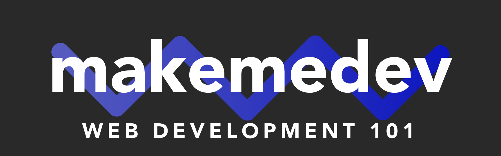

# MakeMeDev Web Development 101

## Ground Rules

1. Class meets twice a week, Wednesday's and Sunday's. Wednesday class hours are 7-10PM and Sunday class hours are 4-7PM.

2. As we cover so much ground so quickly, this is a boot-camp after all 😎, students are advised to limit absences. Essentially a student who misses more than one class may have great difficulty keeping up with further instruction.

3. Students are expected to complete class assignments, assessments, and portfolio-projects. These assessments and assignments are essential to this program, you are a self-taught developer and will be expected to demonstrate your skills to a substantial degree, our coursework will help you do so.

## Pre-Work

Before participating in a MakeMeDev cohort students will be asked to complete a battery of prep-work designed to provide a reasonable foundation for learning and exploring those covered concepts in greater depth.

1. [Learn Command Line](https://tutorial.djangogirls.org/en/intro_to_command_line/)

2. [Install VSCode](https://code.visualstudio.com/docs)
    - Setup (Follow instructions for your device)
    - Getting Started
    - User Guide

3. [Learn Git Basics](https://www.codecademy.com/learn/learn-git)

4. [Learn HTML](https://www.codecademy.com/learn/learn-html)

5. [Learn CSS](https://www.codecademy.com/learn/learn-css)

6. [Introduction to JavaScript](https://www.codecademy.com/learn/introduction-to-javascript)

## Curriculum

### Week 1: Introduction to Web Development

### Week 2: HTML Deep Dive and Semantic Mark-Up

### Week 3: Learn Web Layout, the infamous Box-Model

### Week 4: Design Fundamentals, making beautiful Websites using industry standard tools

### Week 5: Advanced CSS Concepts; Animations, CSSGrid, MediaQueries, and SCSS

### Week 6: CSS Frameworks, using tools the pros-use to make sites that scale

### Week 7: JavaScript Internals

### Week 8: Hacking the DOM and JQuery for productivity

### Week 9: JavaScript Functions Workshop, using APIs, ES6 and beyond

### Week 10: Going Real-time with Google Firebase

### Week 11: Whirlwind tour of the most in-demand JavaScript Frameworks

### Week 12: Learning React, the worlds most powerful and popular JS framework

### Week 13: Interviewing for a Web Development Role, Polishing your Portfolio, and Crafting your Resume

### Week 14: Mock Interview and Final Project Showcase
